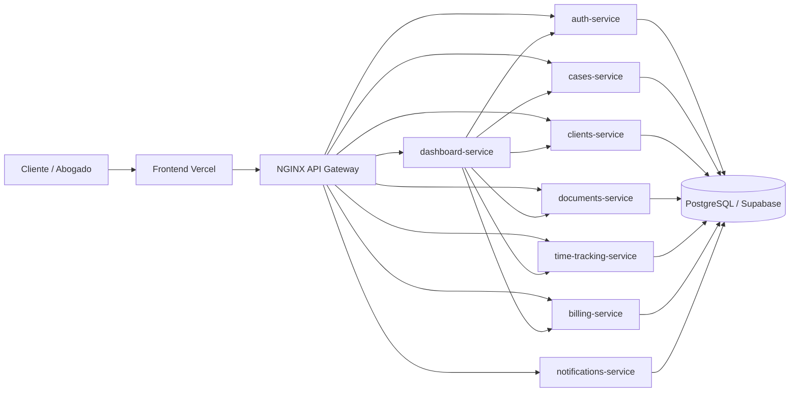
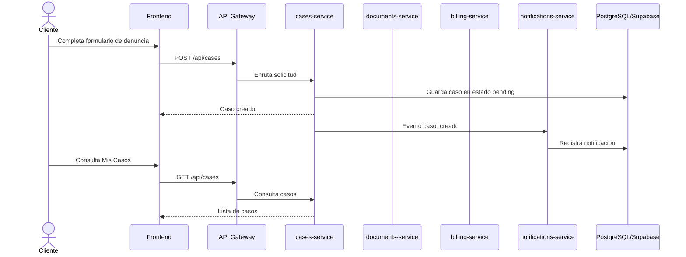
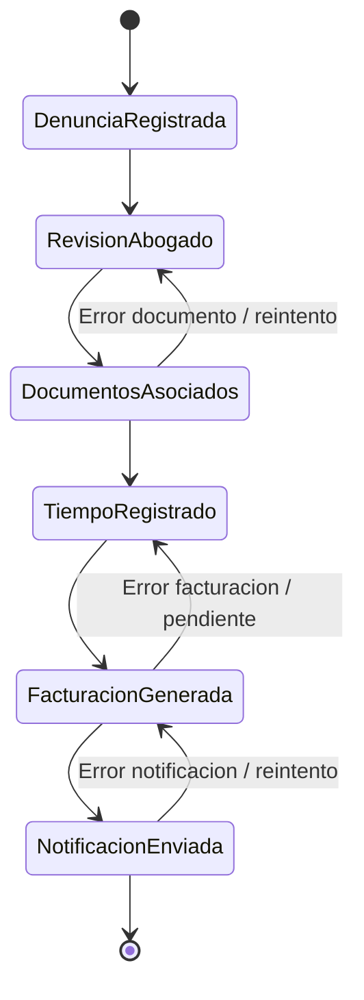
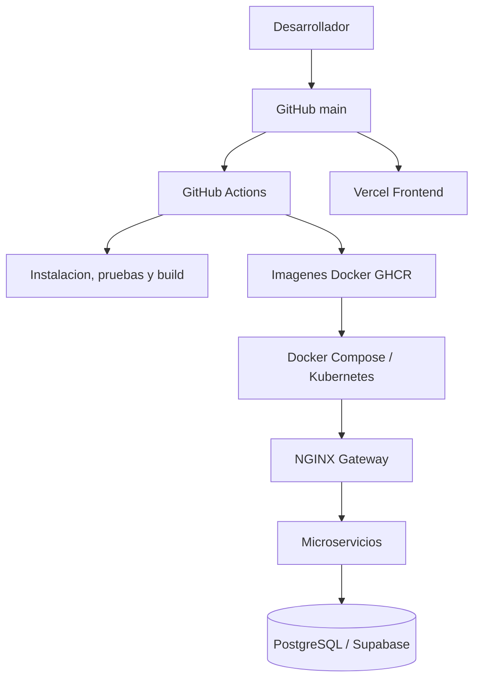

# Arquitectura de Sustentacion

## Vista general

```mermaid
flowchart LR
  U[Cliente / Abogado] --> FE[Frontend Vercel]
  FE --> GW[NGINX API Gateway]
  GW --> AUTH[auth-service]
  GW --> CASES[cases-service]
  GW --> CLIENTS[clients-service]
  GW --> DOCS[documents-service]
  GW --> TIME[time-tracking-service]
  GW --> BILL[billing-service]
  GW --> NOTIF[notifications-service]
  GW --> DASH[dashboard-service]

  AUTH --> DB[(PostgreSQL / Supabase)]
  CASES --> DB
  CLIENTS --> DB
  DOCS --> DB
  TIME --> DB
  BILL --> DB
  NOTIF --> DB
  DASH --> AUTH
  DASH --> CASES
  DASH --> CLIENTS
  DASH --> DOCS
  DASH --> TIME
  DASH --> BILL
```

## Flujo de denuncia

```mermaid
sequenceDiagram
  actor Cliente
  participant Frontend
  participant Gateway as API Gateway
  participant Cases as cases-service
  participant Docs as documents-service
  participant Billing as billing-service
  participant Notifications as notifications-service
  participant DB as PostgreSQL/Supabase

  Cliente->>Frontend: Completa formulario de denuncia
  Frontend->>Gateway: POST /api/cases
  Gateway->>Cases: Enruta solicitud
  Cases->>DB: Guarda caso en estado pending
  Cases-->>Frontend: Caso creado
  Cases->>Notifications: Evento caso_creado
  Notifications->>DB: Registra notificacion
  Cliente->>Frontend: Consulta Mis Casos
  Frontend->>Gateway: GET /api/cases
  Gateway->>Cases: Consulta casos
  Cases-->>Frontend: Lista de casos
```

## SAGA funcional

```mermaid
stateDiagram-v2
  [*] --> DenunciaRegistrada
  DenunciaRegistrada --> RevisionAbogado
  RevisionAbogado --> DocumentosAsociados
  DocumentosAsociados --> TiempoRegistrado
  TiempoRegistrado --> FacturacionGenerada
  FacturacionGenerada --> NotificacionEnviada
  NotificacionEnviada --> [*]

  DocumentosAsociados --> RevisionAbogado: Error documento / reintento
  FacturacionGenerada --> TiempoRegistrado: Error facturacion / pendiente
  NotificacionEnviada --> FacturacionGenerada: Error notificacion / reintento
```

## Despliegue

```mermaid
flowchart TD
  Dev[Desarrollador] --> Git[GitHub main]
  Git --> Actions[GitHub Actions]
  Actions --> Tests[Instalacion, pruebas y build]
  Git --> Vercel[Vercel Frontend]
  Actions --> GHCR[Imagenes Docker GHCR]
  GHCR --> Docker[Docker Compose / Kubernetes]
  Docker --> Gateway[NGINX Gateway]
  Gateway --> Services[Microservicios]
  Services --> DB[(PostgreSQL / Supabase)]
```

